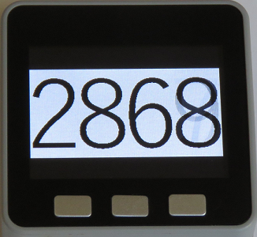

# M5Stack-Counter

 
 

 

 

## About

- This is a basic counter with fast moving digits for the M5Stack.

- The speed of the digits seems to suggest an urgent and important thing is about to happen !!

- More features could be added: sound, font, font colour, background colour, etc.

- [Video demonstration](https://twitter.com/ksasao/status/970196248836755456 "Video Demonstration")

- This code was written by [Kazuhiro Sasao](https://gist.github.com/ksasao/c67d6fff5641e6fd40c7705352f6759e)

- "Do yourself a favour" and view his impressive projects on Twitter - accessible via the video demonstration link above.

